  <h1 align="center">MergeSVG</h1>

    

## Why MergeSVG?
After adding SVG badges and illustrations to my GitHub README, I often saw empty gaps when remote assets failed to load. Moreover, README’s limited Markdown makes it hard to get banner layouts to look exactly the way I want. So I built MergeSVG: a browser-based, drag-and-drop tool that merges SVGs into a single, self-contained file and lets you position, resize and style graphics visually. In conclusion, your README will always appear exactly as you designed it.

## Features
- **Flexible uploads** — Add SVGs via Data URIs, URLs, or raw .svg files (drag & drop or file picker).
- **Design freedom without Markdown limitations** — No markdown or HTML syntax required; design intuitively with drag & drop.
- **Customizable canvas background** — Control background color, transparency, and patterns (grid, dots, checkerboard).
- **Real-time preview** — See your composition as you build it.
- **One-click export** — Download your merged SVG instantly.
- **Client-side processing** — Fast, secure, and private—everything runs in your browser.
- **No more broken links** — The app embeds raw SVG content into a single file so external resources can’t break your layout.

## Live Demo & Preview

link: https://mergesvg.vercel.app/

## How to use
1. Visit the site: https://mergesvg.vercel.app/
2. Upload one or more SVG files to the right sidebar.
3. Drag and drop the uploaded SVGs onto the canvas.
4. Customize the canvas background using the left control panel (optional).
5. Move, resize, and arrange SVGs to create your composition.
6. Click "**Export**" to download your final merged SVG file.
7. Star this repo ~ :smile: 

## Deploy it yourself
Since this project is hosted on a free Vercel account, resources are limited. To ensure optimal performance and availability, it's recommended to deploy MergeSVG on your own. Here's how:
1. Sign in or create a Vercel account at [vercel](https://vercel.com/).

2. Click the "**Deploy to Vercel**" button below

    

3. Follow the prompts to deploy the application to your Vercel account.

## License

This project is licensed under the MIT License. See [LICENSE](LICENSE) for details.
